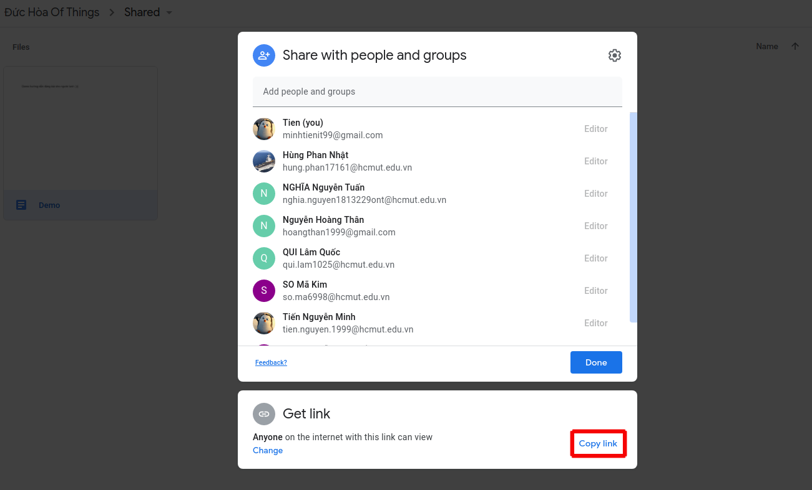
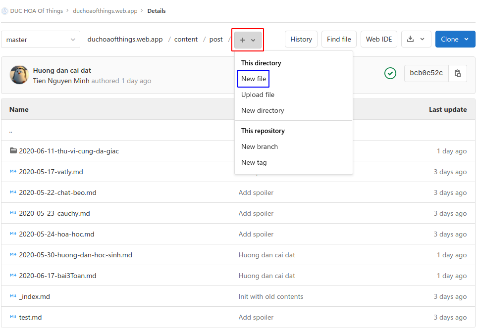
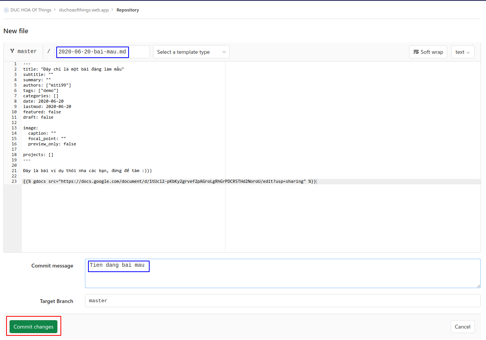
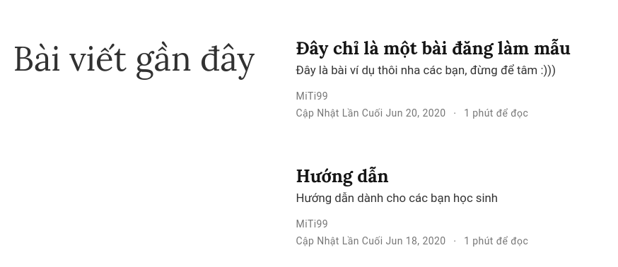
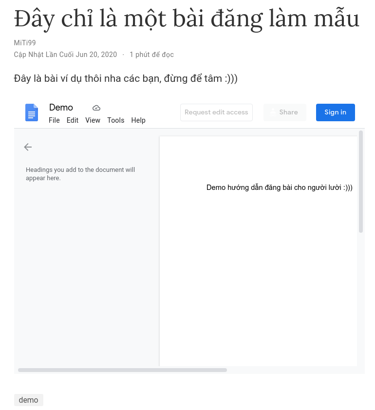
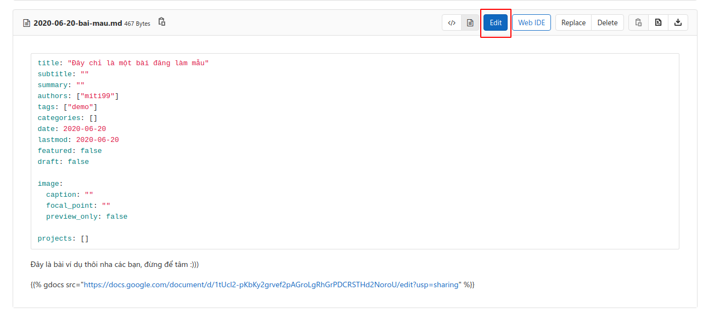
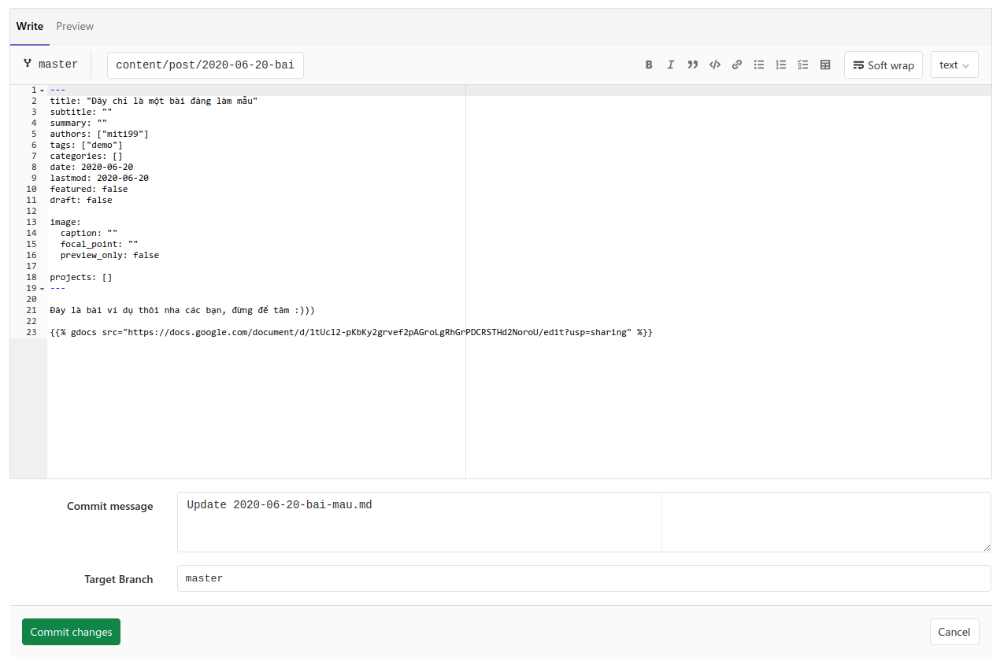

## Tổng quát

Đây là hướng dẫn dành cho bạn nếu bạn quá lười để học cách sử dụng các công cụ mình hướng dẫn: [Git](https://git-scm.com), [Hugo](https://gohugo.io),...

## Giới thiệu

Bằng cách ghi nội dung bài đăng lên Google Docs, bạn sẽ có thể chỉnh sửa nội dung bạn muốn một các dễ dàng, trực quan hơn, và trang web sẽ hiển thị nội dung file Google Docs này cho các bạn. Ví dụ như sau:

{}

Cách này nhằm giúp các bạn ngại khó có thể dễ dàng đăng bài hơn. Rất mong sẽ hữu ích cho các bạn.

## Các bước thực hiện

1. Đầu tiên, hãy tạo một file Google Docs trong thư mục Shared trong **Shared Drive** _(bộ nhớ dùng chung)_ mà mình đã thêm các bạn vào.
2. Sau đó nhấp chuột phải lên file đó, chọn `Share`, rồi nhấn nút `Copy Link` (mình hightlight đỏ đỏ) như hình sau: 
3. Tiếp theo, bạn vào thư mục `content/post` repository trên Gitlab của chúng ta tại [link này](https://gitlab.com/duchoaofthings/duchoaofthings.web.app/-/tree/master/content/post), tạo file mới bằng cách nhấn vào dấu `+` rồi chọn `New file` như hình sau: 
4. Bây giờ bạn copy mẫu dưới đây và điền vào **ở đầu file** nhé! Nhớ chỉnh sửa lại thông tin cho đúng với bạn nha!

```toml
---
title: "Đây chỉ là một bài đăng làm mẫu"
subtitle: ""
summary: ""
authors: ["miti99"]
tags: ["demo"]
categories: []
date: 2020-06-20
lastmod: 2020-06-20
featured: false
draft: false

image:
  caption: ""
  focal_point: ""
  preview_only: false

projects: []
---
```

Tạm thời bạn có thể chỉ cần quan tâm đến các mục sau:

- `title`: tiêu đề bài viết của bạn
- `authors`: tên bạn, nếu bạn đã tạo tài khoản như mình đã hướng dẫn trong video thì bạn điền tên thư mục của bạn vào (như mình là `miti99` ở trên), nếu bạn chưa tạo thì cứ điền tên bạn thích, vd `Minh Tiến`
- `tags`: thẻ bạn muốn gắn, vd như tên môn học mà bài bạn đăng, `Toán`, `Lý`, `Hóa` chẳng hạn.
- Và cuối cùng là `date`, ngày đăng, ở đây định dạng ngày là yyyy-mm-dd nha các bạn.
- Các mục còn lại bạn cũng có thể điền (nếu biết cách), hoặc đợi mình hướng dẫn trong những bài hướng dẫn sau.

5. Dưới phần trên, bạn có thể ghi thêm vài dòng ghi chú (nếu thích), sau đó copy đoạn mã sau vào:

```md
{}
```

Thay thế đoạn `https://docs.google.com/document/d/1tUcl2-pKbKy2grvef2pAGroLgRhGrPDCRSTHd2NoroU/edit?usp=sharing` bằng link của file Google Docs bạn đã tạo ở bước 1 nhé!

6. Điền một số thông tin cần thiết vào form commit của Gitlab:

- Mục `File name` nên điền theo mẫu là `yyyy-mm-dd-tieu-de.md`, vd của mình là `2020-06-20-bai-mau.md`, nhớ có đuôi `.md` mới được nha, dùng tiếng Việt không dấu (hoặc tiếng Anh nếu bạn pro :))), không được có khoảng trắng (thay khoảng trắng bằng dấu `-` ấy).
- Mục `Commit message` thì nên điền theo kiểu cho mình biết nội dung bạn làm gì, vd "Tien dang bai mau"

Sau khi hoàn tất thì sẽ trông như sau: 

7. Xong xuôi rồi thì nhấn `Commit Changes`, đợi khoảng 2 phút để hệ thống CI/CD của mình deploy, sau đó vào trang web xem thành quả nha.





8. Nếu bạn muốn sửa bài viết đã đăng, hãy nhấp vào file của bài viết đó, chọn `Edit` và làm tương tự như nãy giờ nha.





## Lưu ý

1. Do mình chỉ đăng bài làm mẫu thôi, nên sau bài này mình sẽ gỡ khỏi trang web nha, bạn đừng tìm mẫu làm gì :v
2. Đây chỉ là **giải pháp tạm thời** nhằm hỗ trợ các bạn trong thời gian này. Mình vẫn muốn các bạn tìm hiểu, làm theo hướng dẫn của mình để đăng bài hoàn chỉnh hơn. Trước mắt các bạn có thể đăng như vậy, mình sẽ vào kiểm tra và nếu quỡn mình sẽ chuyển thành bài viết hoàn chỉnh giùm các bạn.
