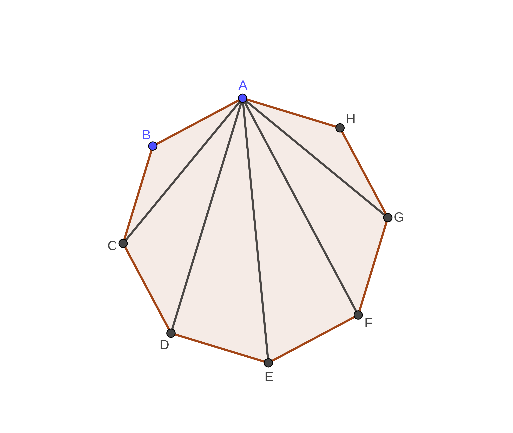
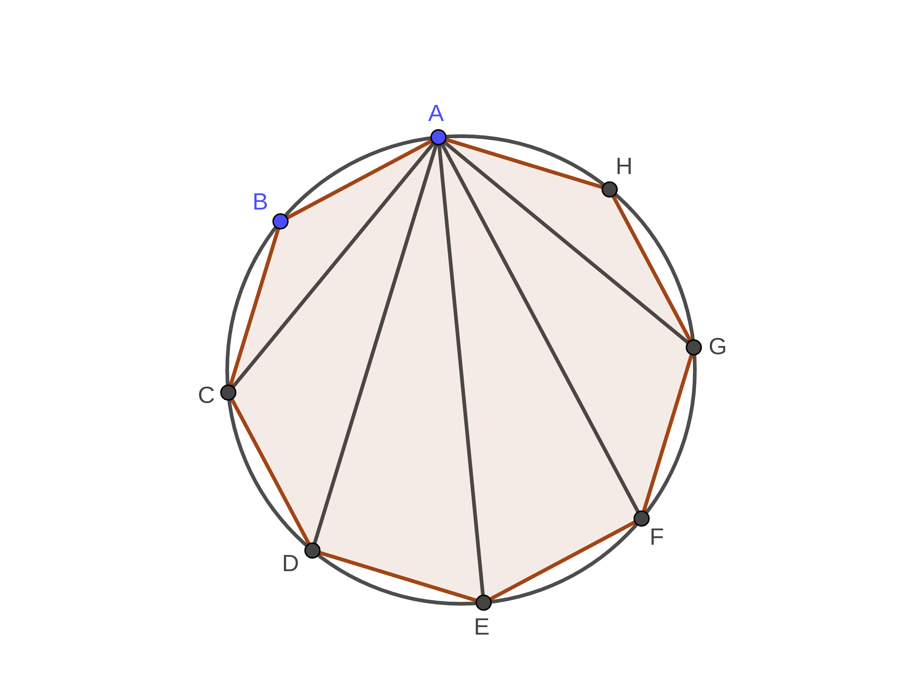

**->** _Chắc hẳn từ cấp 2 đến cấp 3 bạn đã gặp đa giác rất nhiều, và cũng biết rằng đa giác đều là một loại đa giác đặc biệt, và cũng có những tính chất riêng (rất thú vị) của chúng. Vậy bạn có biết điều sau?_

> Trong một đa giác đều, nếu bạn vẽ tất cả đường chéo của một đỉnh thì chúng sẽ chia đỉnh đó thành những góc bằng nhau.
> _(Câu trên là mình nói đó :v)_

**Ví dụ:** _Với hình bát giác đều ABCDEFGH, ta vẽ các đường chéo AC, AD, AE, AF, AG, thì các góc $\widehat{BAC}$, $\widehat{CAD}$, $\widehat{DAE}$, $\widehat{EAF}$, $\widehat{FAG}$, $\widehat{GAH}$_ sẽ bằng nhau.

**Chứng minh:** _(mình nói cho bát giác đều bên trên nhé, những hình khác cũng tương tự thôi)_

- Nhờ tính chất của đa giác đều, ta biết rằng một đa giác đều sẽ nội tiếp một đường tròn. Trên đường tròn này, các cung BC, CD, DE, EF, FG, GH bằng nhau do các dây BC, CD, DE, EF, FG, GH bằng nhau. (1)

- Các góc $\widehat{BAC}$, $\widehat{CAD}$, $\widehat{DAE}$, $\widehat{EAF}$, $\widehat{FAG}$, $\widehat{GAH}$ là các góc nội tiếp lần lượt chắn các cung BC, CD, DE, EF, FG, GH. (2)

Từ (1) và (2) ta có điều phải chứng minh.

**P.S.** _Các bạn có thấy bài viết của mình thú vị không?_

- Nếu thấy hay, các bạn hãy chia sẻ bài viết này để nhiều bạn biết đến chúng mình hơn và cùng "lót dép" hóng những bài viết thú vị tiếp theo trong tương lai của mình nhé!^^
- Nếu không hay hoặc thấy có vấn đề gì đó trong bài viết của mình, hãy comment bên dưới cho mình biết để khắc phục nha!

**->** _Cảm ơn các bạn đã dành thời gian đọc bài của mình^^_
